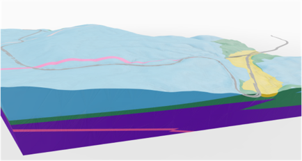

# Making underground voxel data available to the masses

This project was an audience challenge presented at the 
[Open Source Construction, AEC Hackathon Zürich](https://opensource.construction/events/aec-hackathon-zurich-2025/)
in February 2025, an event where folks in the architecture, engineering, and construction (AEC) industries come together 
to tackle problems relevant to us. 

# why voxels and not solids
Unless your building floats or flies, you’re building on the ground, and you need to know what’s underground. 
Much progress has been made getting subsurface, site investigation data into civil engineering workflows. For instance,
Look at this example of 3D solids being used to represent geological units underground: 

However, models like these are lies! They fail to communicate two keys things: 
- natural materials can be highly heterogenous
- there can me high or variably degree of uncertainty in ground conditions

Voxel models are all the rage in nerdier circles, and have some key advantages: 
- They can communicate uncertainty and gradual changes in ground conditions more easily. 
- They make certain types of calculations easier (e.g., excavation volumes for earthworks)
- They provide nuanced input for numerical modelling, enabling probabilistic methods

# solutions

## Cesium Viewer
Lightweight 3D web viewer with georeferencing and sattelite imagery that shows context

## Speckle transform 
Make the data available in a popular AEC circles

## NetCDF transform 
for use of commercial software

# test datasets
provided courtesy of EMerald Geomodelling AS [web](https://www.emerald-geomodelling.com/) 
[github](https://github.com/emerald-geomodelling) and Bane NOR [web](https://www.banenor.no/en/). 

In various formats 
- Paraview files like .vtk, .vtu, .vts
- NetCDF 

Related to an airborne electromagnetic survey of the FRE16 road and railway project performed in June 2016. 
Models include an electrical resistivity model, and some interpreted products like depth to bedrock or 
probability of sensitive glaciomarine clay (quick clay). More information about the project is described in
this publication: https://doi.org/10.1016/j.enggeo.2021.106484 

# Contributors
Original team members from the February 2025 hackathon were: 

- [Jules Blom](https://github.com/JulesBlm)
- [Martijn van Blijswijk](https://github.com/Martijn-van-Blijswijk)
- [Alex Orsholits](https://github.com/meh301)
- [Christian Kongsgaard](https://github.com/ocni-dtu)
- [Sven Rüegg](https://github.com/svenruegg)
- [Joost Gevaert](https://github.com/JoostGevaert)
- [Craig William Christensen](https://github.com/Duke-of-Lizard)
- Sasipa Vichitkraivin
- [Harmodio I. Barrios R.](https://www.linkedin.com/in/barriosrios/)

