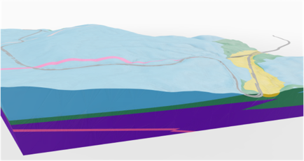
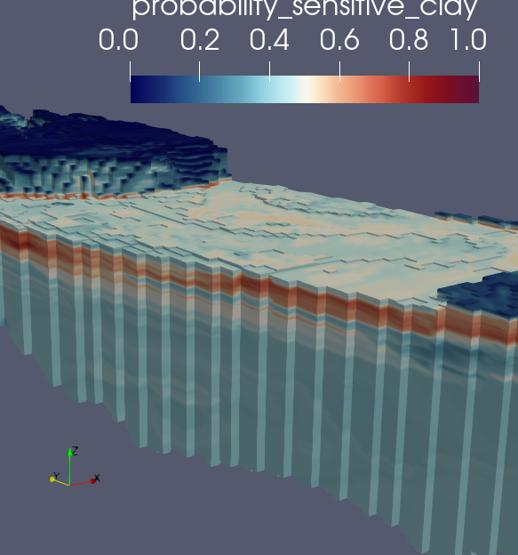
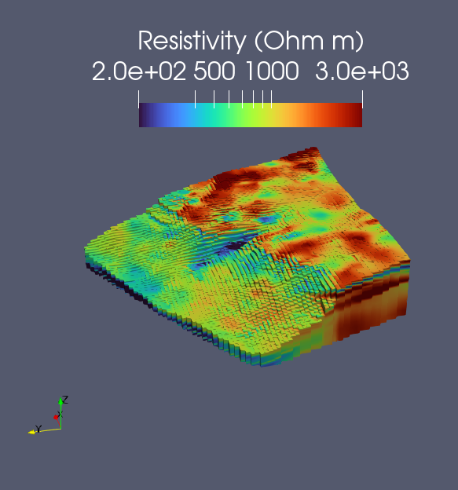

# Making underground voxel data available to the masses

This project was an audience challenge presented at the 
[Open Source Construction, AEC Hackathon Zürich](https://opensource.construction/events/aec-hackathon-zurich-2025/)
in February 2025, an event where folks in the architecture, engineering, and construction (AEC) industries come together 
to tackle problems relevant to us. 

# why voxels and not solids
Unless your building floats or flies, you’re building on the ground, and you need to know what’s underground. 
Much progress has been made getting subsurface, site investigation data into civil engineering workflows. For instance,
Look at this example of 3D solids being used to represent geological units underground: 

However, models like these are lies! They fail to communicate two keys things: 
- natural materials can be highly heterogenous
- there can me high or variably degree of uncertainty in ground conditions

Voxel models are all the rage in nerdier circles, and have some key advantages: 
- They can communicate uncertainty and gradual changes in ground conditions more easily. 
- They make certain types of calculations easier (e.g., excavation volumes for earthworks)
- They provide nuanced input for numerical modelling, enabling probabilistic methods

However, their widespread adoption in AEC is hindered by these hurdles: 
- Few commonplace software packages lets user see voxel and structural data together
- Programs that do show them can be complicated to use, and may not show voxel with geospatial context (e.g., satelite images, structural geometry)
- The files can be large and slow 

Need decision makers to more easily visualize and see value in voxel models if we want buy-in for using voxels!

# Our solutions

## Cesium Viewer
Lightweight 3D web viewer with georeferencing and sattelite imagery that shows context

## Speckle transform 
Make the data available in a popular AEC circles

## NetCDF transform 
for use of commercial software like ArcGIS

## other unexplored routes 

Paraview VTK web viewer

# test datasets
The FRE16 datasets `data/FRE16` and `data/FRE16_south` were provided courtesy of EMerald Geomodelling AS [web](https://www.emerald-geomodelling.com/) 
[github](https://github.com/emerald-geomodelling) and Bane NOR [web](https://www.banenor.no/en/). Formats provided include 
- Paraview files like .vtk, .vtu, .vts
- NetCDF 

All datasets are in ERTS89 UTM zone 32 North (https://epsg.io/25832)

They are related to an airborne electromagnetic survey of the FRE16 road and railway project performed in June 2016. 
Models include an electrical resistivity model, and some interpreted products like depth to bedrock or 
probability of sensitive glaciomarine clay (quick clay). More information about the project is described in
this publication: https://doi.org/10.1016/j.enggeo.2021.106484

# Contributors
Original team members from the February 2025 hackathon were: 

- [Jules Blom](https://github.com/JulesBlm)
- [Martijn van Blijswijk](https://github.com/Martijn-van-Blijswijk)
- [Alex Orsholits](https://github.com/meh301)
- [Christian Kongsgaard](https://github.com/ocni-dtu)
- [Sven Rüegg](https://github.com/svenruegg)
- [Joost Gevaert](https://github.com/JoostGevaert)
- [Craig William Christensen](https://github.com/Duke-of-Lizard)
- [Sasipa Vichitkraivin](https://www.linkedin.com/in/sasipa-vichitkraivin-78636b1b4/)
- [Harmodio I. Barrios R.](https://www.linkedin.com/in/barriosrios/)

# Useful links

Just a dump of many of the resources we considered or referred to when researching and brainstorming solutions

Construction of NetCDF files
- helpful Python tutorial: https://nordatanet.github.io/NetCDF_in_Python_from_beginner_to_pro/intro.html
- explanations on how to use projected coordinates 
  - https://cfconventions.org/Data/cf-conventions/cf-conventions-1.6/build/cf-conventions.html#appendix-grid-mappings
  - https://cfconventions.org/Data/cf-conventions/cf-conventions-1.7/build/ch05s06.html
  - https://pro.arcgis.com/en/pro-app/latest/help/data/multidimensional/spatial-reference-for-netcdf-data.htm

Generating 3D tiles in Cesium 
- from Paraview VTK: https://www.kitware.com/3d-tiles-generation-using-vtk/
- point tiling (catered to Japanese coordinate reference systems): https://github.com/MIERUNE/point-tiler/pulls
- point tiling for large datasets: https://github.com/connormanning/entwine

Generating 3D tiles in WebJS
- https://github.com/NASA-AMMOS/3DTilesRendererJS

Loading NetCDF into Cesium: 
- https://github.com/RaymanNg/3D-Wind-Field/blob/ead08dd8b81737b8eefd7fd93d6341ae6d025dde/Cesium-3D-Wind/dataProcess.js

Voxels example from Cesium:
https://sandcastle.cesium.com/?src=Voxels.html
https://github.com/CesiumGS/cesium/blob/main/Apps/Sandcastle/gallery/Voxels.html

VTK.js + Cesium:
VTK.js can be used for rendering scientific data, while Cesium provides 3D geographic context.
To integrate both, you'd have to create Cesium compatible 3D tiles from VTK:
https://docs.vtk.org/en/latest/modules/vtk-modules/IO/Cesium3DTiles/README.html

VTK.js + MapLibre:
MapLibre is a JavaScript library for interactive 3D maps. You can use VTK.js to render your scientific data and then overlay it on a 3D map created with MapLibre, which can include terrain and building data.
https://github.com/Kitware/vtk-js/issues/645

3D Buildings and Terrain from MapLibre:
https://maplibre.org/maplibre-gl-js/docs/examples/

